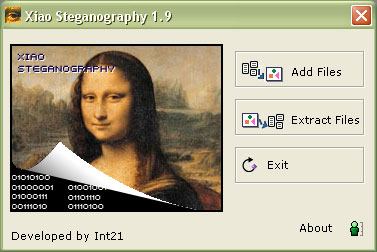



## Xiao Steganography 1\.9 \(Final\)

### Description

After the great success of the version 1.0 , coming to you version 1.9

* 60% more faster than v1.0

* Can attach any file, doesn't matter the type file (limited by the size of image)

* Security added, can Encryption / Decryption with RC2, RC4, DES, Triple DES , Triple Des 112 and Hashing MD2, MD4, MD5, SHA Algorithms through using password protected.

* Some features fixed and improved

* Some features added

I hope this new version can be PSC winner.

Don't be timid, express your comments and if you think i deserve, give a nice rate!

more info: http://www26.brinkster.com/blackc/xiao/eng
 
### More Info
 

             |
---                |---
**Submitted On**   |2005-07-01 09:04:50
**By**             |[Int\_21](https://github.com/Planet-Source-Code/PSCIndex/blob/master/ByAuthor/int-21.md)
**Level**          |Advanced
**User Rating**    |4.8 (87 globes from 18 users)
**Compatibility**  |VB 5\.0, VB 6\.0
**Category**       |[Encryption](https://github.com/Planet-Source-Code/PSCIndex/blob/master/ByCategory/encryption__1-48.md)
**World**          |[Visual Basic](https://github.com/Planet-Source-Code/PSCIndex/blob/master/ByWorld/visual-basic.md)
**Archive File**   |[Xiao\_Stega190775712005\.zip](https://github.com/Planet-Source-Code/int-21-xiao-steganography-1-9-final__1-61442/archive/master.zip)

